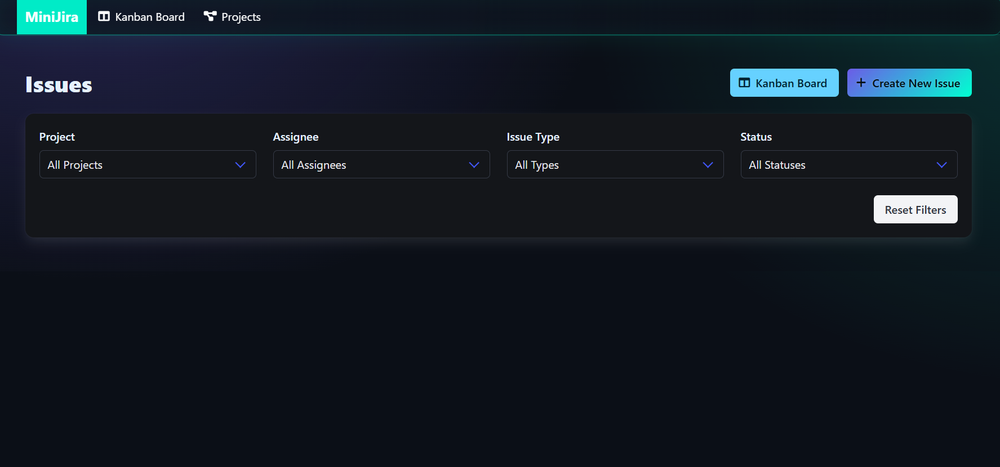
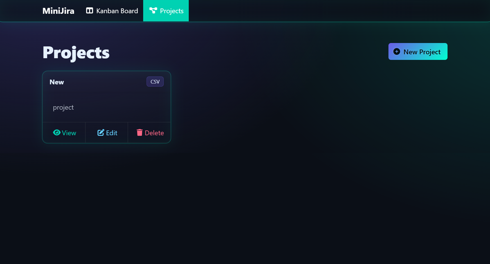
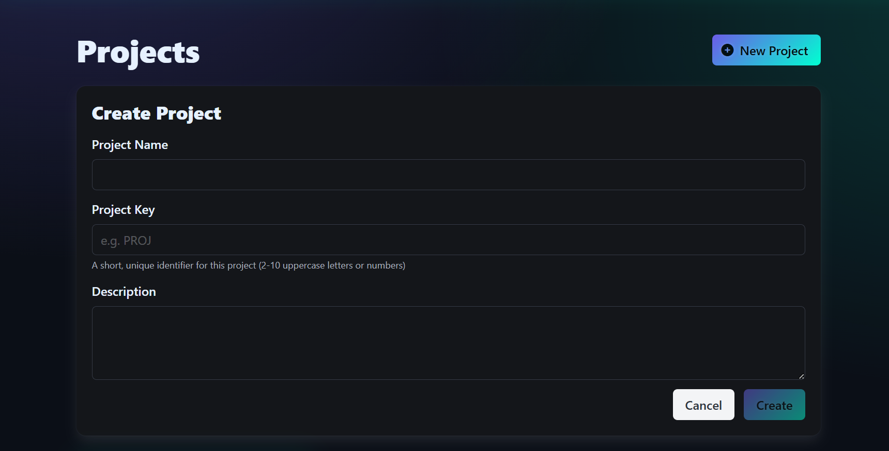
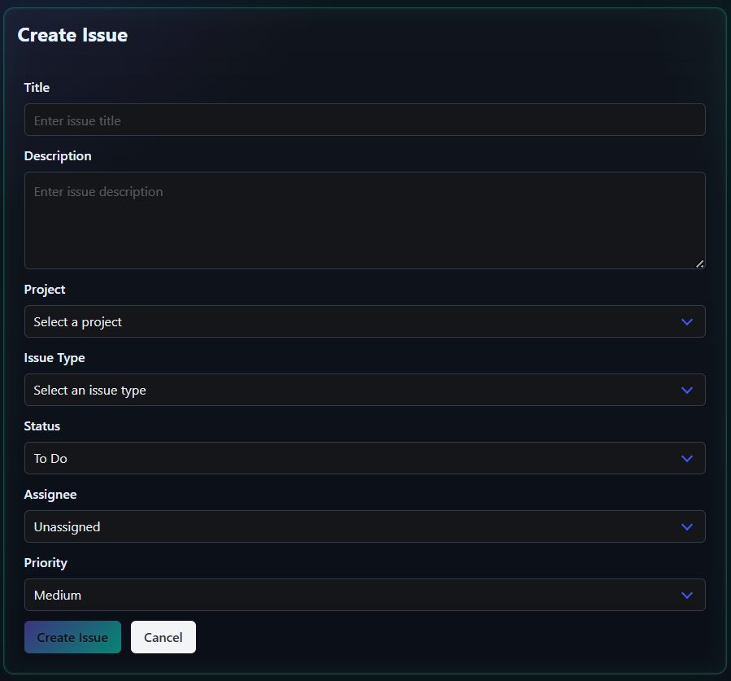
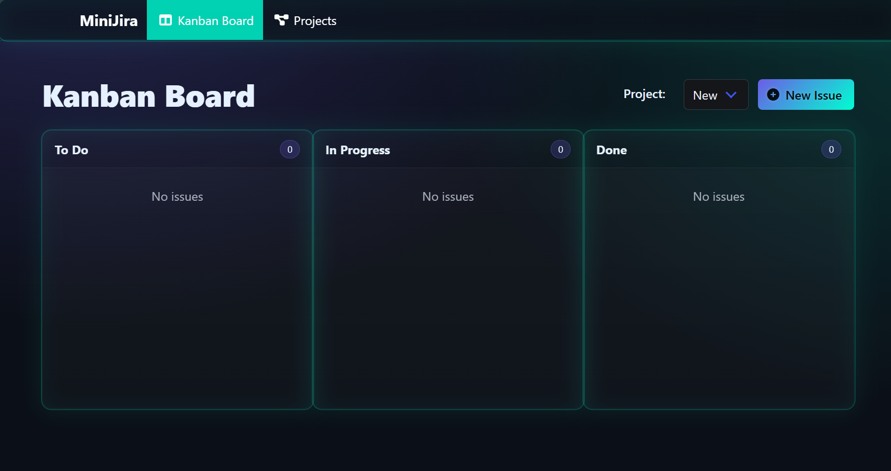

# MiniJira

A minimal Jira-like project management tool built with Angular and ASP.NET Core.

## Features

- Project and issue management
- Kanban board for workflow visualization
- User assignment and issue types
- Responsive UI with Bulma CSS

## Screenshots

### Home

### Project List

### Project Form

### Issue Form

### Kanban Board

